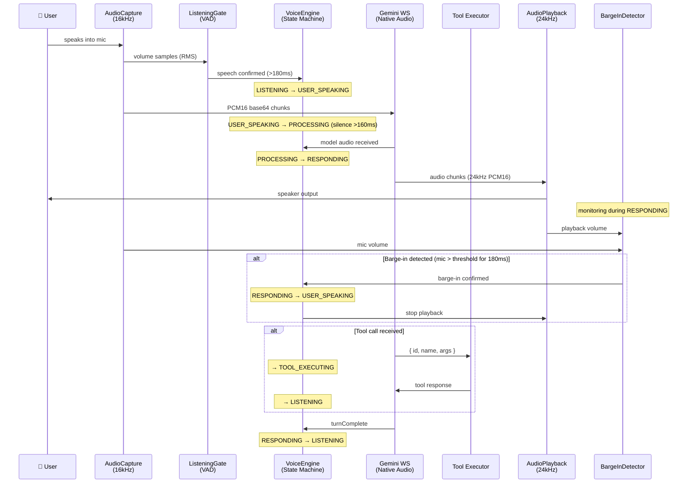
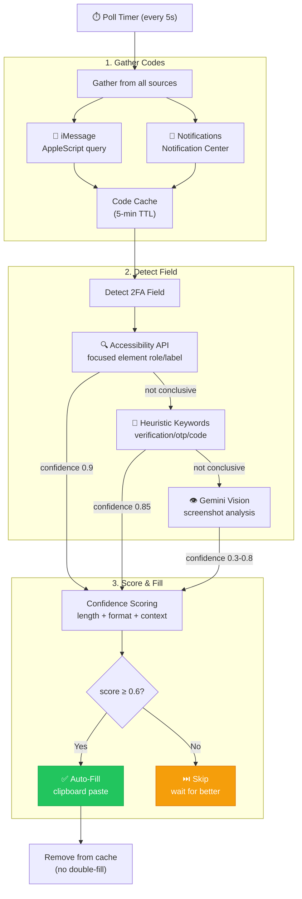
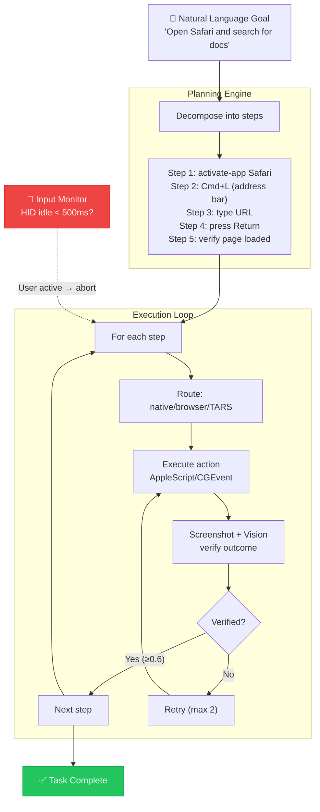

# Iris-chan Architecture

```mermaid
graph TB
    subgraph Input["🎤 User Input Layer"]
        MIC["Microphone<br/>16kHz PCM16"]
        SCR["Screen<br/>Retina capture"]
        KB["Keyboard/Mouse<br/>HID monitoring"]
        CLIP["Clipboard<br/>URL monitoring"]
    end

    subgraph Renderer["🖥️ Renderer Process (Electron BrowserWindow)"]
        direction TB
        subgraph Avatar["Three.js Avatar"]
            SCENE["Scene<br/>30° FOV, 22% offset"]
            VRM["VRM/glTF Loader<br/>tripo3d model"]
            OVERLAY["Procedural Overlays<br/>blink · lip sync · head look · smile"]
            LIGHT["Reactive Light Rig<br/>thinking: pulse · speaking: damped · idle: drift"]
        end

        subgraph UI["UI Overlay"]
            BUBBLES["Chat Bubbles<br/>3 lanes: chat/context/thinking"]
            TIMELINE["Activity Timeline<br/>30 events, phase-colored"]
            DEBUG["Debug Panel<br/>10 status dots"]
            TOOLLOG["Tool Log<br/>max 5, auto-hide"]
        end

        subgraph Voice["Voice Pipeline"]
            CAPTURE["AudioCapture<br/>WebAudio 16kHz"]
            GATE["ListeningGate<br/>adaptive noise floor"]
            ENGINE["VoiceEngine<br/>6-state machine"]
            BARGEIN["BargeInDetector<br/>playback-compensated"]
            PLAYBACK["AudioPlayback<br/>24kHz output"]
        end

        subgraph Gemini["Gemini WebSocket"]
            GEMINWS["BidiGenerateContent<br/>gemini-2.5-flash-native-audio"]
            TOOLS_DECL["47 Tool Declarations"]
            FALLBACK["Fallback Profiles<br/>full → no-voice → core → compact"]
        end

        PRELOAD["window.irisBus / electronAPI<br/>IPC Bridge"]
    end

    subgraph Main["⚙️ Main Process (Electron)"]
        direction TB
        BOOTSTRAP["Bootstrap<br/>module init + IPC registration"]
        IPC["IPC Layer<br/>preload.js bridge"]

        subgraph Modules["Core Modules"]
            direction LR
            TOOLS["Tools<br/>21+ built-in<br/>registry + executor"]
            SCREEN["Screen Capture<br/>Retina normalize<br/>coordinate mapping"]
            VOCAB["Vocabulary<br/>260+ terms<br/>fuzzy matching"]
            SKILLS["Skills<br/>~/.iris/skills/<br/>custom JS/TS"]
        end

        subgraph Intelligence["Intelligence"]
            direction LR
            AUTONOMY["Autonomy<br/>Groq intent predict<br/>10s intervals"]
            PROACTIVE["Proactive Engine<br/>screen analysis<br/>suggestions"]
            DAILY["Daily Loop<br/>Ghost CMS drafts<br/>1h tick"]
            CODING["Coding<br/>Claude Agent SDK<br/>self-improvement"]
        end

        subgraph Automation["Desktop Automation"]
            direction LR
            PLANNER["Planning Engine<br/>goal decomposition"]
            EXEC["Execution Policy<br/>native/browser/TARS"]
            VERIFY["Verification<br/>screenshot + vision"]
            NATIVE["Native Actions<br/>AppleScript/CGEvent"]
        end

        subgraph TwoFA["2FA Auto-Fill"]
            direction LR
            ORCH["Orchestrator<br/>5s poll loop"]
            DETECT["Detector<br/>AX + Gemini Vision"]
            SOURCES["Sources<br/>iMessage · Mail<br/>Notifications"]
            CACHE["Code Cache<br/>5-min TTL"]
            FILL["Auto-Fill<br/>clipboard paste"]
        end

        subgraph Tasks["Task System"]
            QUEUE["Task Queue<br/>FIFO p0/p1/p2"]
            KANBAN["Kanban Board<br/>todo/progress/done"]
        end
    end

    subgraph External["☁️ External Services"]
        GEMINI_API["Google Gemini API<br/>WebSocket + REST"]
        GROQ["Groq API<br/>LLaMA 3.3-70B"]
        CONVEX["Convex DB<br/>11 tables<br/>1024-dim vectors"]
        GHOST["Ghost CMS<br/>daily drafts"]
        MACP["MACP Relay<br/>multi-agent"]
    end

    subgraph Storage["💾 Local State"]
        IRIS_DIR["~/.iris/<br/>settings · vocab · feedback<br/>memory · patterns · geometry<br/>logs/iris.log (2MB rotate)"]
    end

    %% Input → Renderer
    MIC --> CAPTURE
    SCR --> SCREEN
    KB --> ENGINE
    CLIP --> VOCAB

    %% Voice Pipeline Flow
    CAPTURE --> GATE
    GATE -->|"speech detected"| ENGINE
    ENGINE -->|"PCM16 base64"| GEMINWS
    GEMINWS -->|"audio response"| PLAYBACK
    GEMINWS -->|"tool call"| IPC
    PLAYBACK --> BARGEIN
    BARGEIN -->|"user interrupts"| ENGINE

    %% Gemini ↔ Tools
    IPC --> TOOLS
    TOOLS --> NATIVE
    TOOLS --> SCREEN
    TOOLS --> VOCAB

    %% UI updates
    ENGINE -->|"state changed"| DEBUG
    GEMINWS -->|"transcript"| BUBBLES
    TOOLS -->|"execution log"| TOOLLOG
    VERIFY -->|"events"| TIMELINE

    %% Automation flow
    PLANNER --> EXEC
    EXEC --> NATIVE
    EXEC --> VERIFY
    VERIFY --> SCREEN

    %% 2FA flow
    ORCH --> DETECT
    DETECT --> SCREEN
    ORCH --> SOURCES
    SOURCES --> CACHE
    CACHE --> FILL
    FILL --> NATIVE

    %% Intelligence flow
    AUTONOMY --> GROQ
    PROACTIVE --> GEMINI_API
    DAILY --> GHOST
    CODING --> External

    %% External connections
    GEMINWS --> GEMINI_API
    SCREEN -.->|"vision analysis"| GEMINI_API
    TOOLS -.-> CONVEX
    QUEUE --> CODING
    KANBAN --> QUEUE
    BOOTSTRAP --> MACP

    %% Storage
    TOOLS --> IRIS_DIR
    VOCAB --> IRIS_DIR
    AUTONOMY --> IRIS_DIR
    CACHE --> IRIS_DIR

    %% Styling
    classDef google fill:#4285f4,stroke:#1a73e8,color:#fff
    classDef groq fill:#f97316,stroke:#ea580c,color:#fff
    classDef convex fill:#8b5cf6,stroke:#7c3aed,color:#fff
    classDef ghost fill:#15171a,stroke:#394047,color:#fff

    class GEMINI_API google
    class GROQ groq
    class CONVEX convex
    class GHOST ghost
```

## Voice Conversation Flow

```mermaid
sequenceDiagram
    participant User as 🎤 User
    participant Capture as AudioCapture<br/>(16kHz)
    participant Gate as ListeningGate<br/>(VAD)
    participant Engine as VoiceEngine<br/>(State Machine)
    participant Gemini as Gemini WS<br/>(Native Audio)
    participant Tools as Tool Executor
    participant Playback as AudioPlayback<br/>(24kHz)
    participant BargeIn as BargeInDetector

    User->>Capture: speaks into mic
    Capture->>Gate: volume samples (RMS)
    Gate->>Engine: speech confirmed (>180ms)
    Note over Engine: LISTENING → USER_SPEAKING

    Capture->>Gemini: PCM16 base64 chunks
    Note over Engine: USER_SPEAKING → PROCESSING (silence >160ms)

    Gemini->>Engine: model audio received
    Note over Engine: PROCESSING → RESPONDING

    Gemini->>Playback: audio chunks (24kHz PCM16)
    Playback->>User: speaker output

    Note over BargeIn: monitoring during RESPONDING
    Playback->>BargeIn: playback volume
    Capture->>BargeIn: mic volume

    alt Barge-in detected (mic > threshold for 180ms)
        BargeIn->>Engine: barge-in confirmed
        Note over Engine: RESPONDING → USER_SPEAKING
        Engine->>Playback: stop playback
    end

    alt Tool call received
        Gemini->>Tools: { id, name, args }
        Note over Engine: → TOOL_EXECUTING
        Tools->>Gemini: tool response
        Note over Engine: → LISTENING
    end

    Gemini->>Engine: turnComplete
    Note over Engine: RESPONDING → LISTENING
```

## 2FA Auto-Fill Flow

```mermaid
flowchart TD
    POLL["⏱️ Poll Timer (every 5s)"] --> GATHER

    subgraph Gather["1. Gather Codes"]
        GATHER["Gather from all sources"]
        IMSG["📱 iMessage<br/>AppleScript query"]
        NOTIF["🔔 Notifications<br/>Notification Center"]
        GATHER --> IMSG
        GATHER --> NOTIF
        IMSG --> CODECACHE["Code Cache<br/>(5-min TTL)"]
        NOTIF --> CODECACHE
    end

    CODECACHE --> DETECT

    subgraph Detect["2. Detect Field"]
        DETECT["Detect 2FA Field"]
        AX["🔍 Accessibility API<br/>focused element role/label"]
        HEUR["📝 Heuristic Keywords<br/>verification/otp/code"]
        VISION["👁️ Gemini Vision<br/>screenshot analysis"]
        DETECT --> AX
        AX -->|"not conclusive"| HEUR
        HEUR -->|"not conclusive"| VISION
    end

    AX -->|"confidence 0.9"| SCORE
    HEUR -->|"confidence 0.85"| SCORE
    VISION -->|"confidence 0.3-0.8"| SCORE

    subgraph Score["3. Score & Fill"]
        SCORE["Confidence Scoring<br/>length + format + context"]
        THRESHOLD{"score ≥ 0.6?"}
        FILL["✅ Auto-Fill<br/>clipboard paste"]
        SKIP["⏭️ Skip<br/>wait for better"]
        SCORE --> THRESHOLD
        THRESHOLD -->|"Yes"| FILL
        THRESHOLD -->|"No"| SKIP
    end

    FILL --> REMOVE["Remove from cache<br/>(no double-fill)"]

    style FILL fill:#22c55e,stroke:#16a34a,color:#fff
    style SKIP fill:#f59e0b,stroke:#d97706,color:#fff
```

## Desktop Automation Flow

```mermaid
flowchart TD
    GOAL["🎯 Natural Language Goal<br/>'Open Safari and search for docs'"] --> PLAN

    subgraph Plan["Planning Engine"]
        PLAN["Decompose into steps"]
        STEPS["Step 1: activate-app Safari<br/>Step 2: Cmd+L (address bar)<br/>Step 3: type URL<br/>Step 4: press Return<br/>Step 5: verify page loaded"]
    end
    PLAN --> STEPS

    STEPS --> LOOP

    subgraph Loop["Execution Loop"]
        LOOP["For each step"]
        ROUTE["Route: native/browser/TARS"]
        EXEC["Execute action<br/>AppleScript/CGEvent"]
        VERIFY["Screenshot + Vision<br/>verify outcome"]
        RETRY{"Verified?"}
        NEXT["Next step"]
        FAIL["Retry (max 2)"]

        LOOP --> ROUTE
        ROUTE --> EXEC
        EXEC --> VERIFY
        VERIFY --> RETRY
        RETRY -->|"Yes (≥0.6)"| NEXT
        RETRY -->|"No"| FAIL
        FAIL --> EXEC
        NEXT --> LOOP
    end

    MONITOR["👤 Input Monitor<br/>HID idle < 500ms?"] -.->|"User active → abort"| LOOP

    NEXT --> DONE["✅ Task Complete"]

    style DONE fill:#22c55e,stroke:#16a34a,color:#fff
    style MONITOR fill:#ef4444,stroke:#dc2626,color:#fff
```
